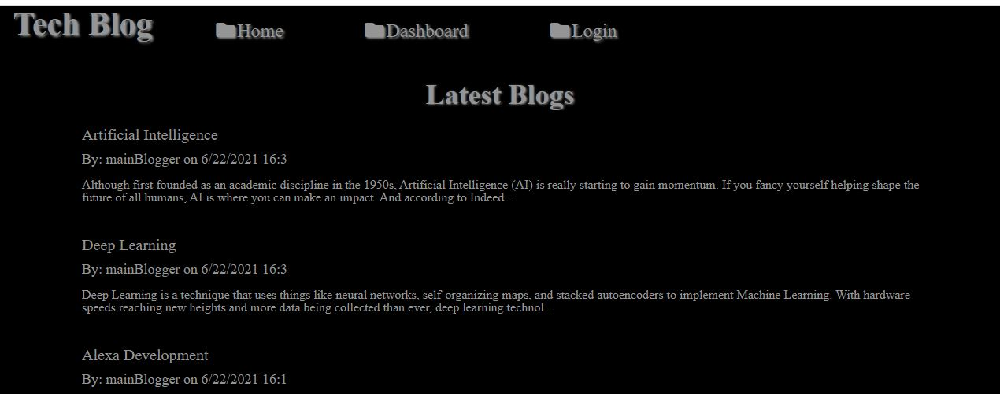
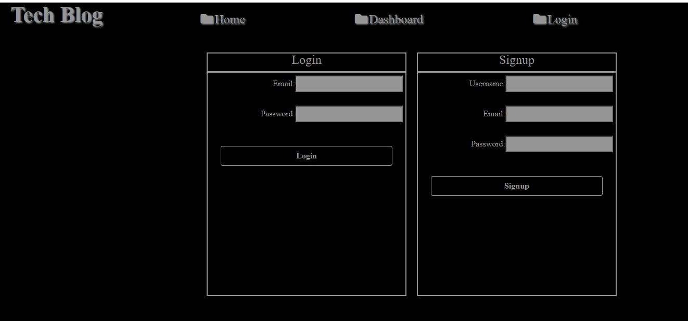
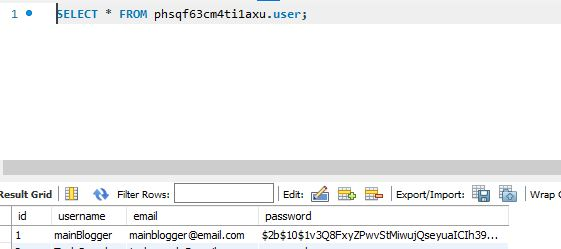
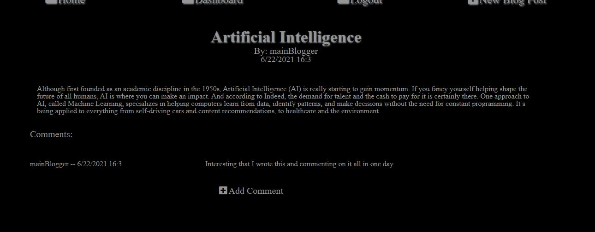
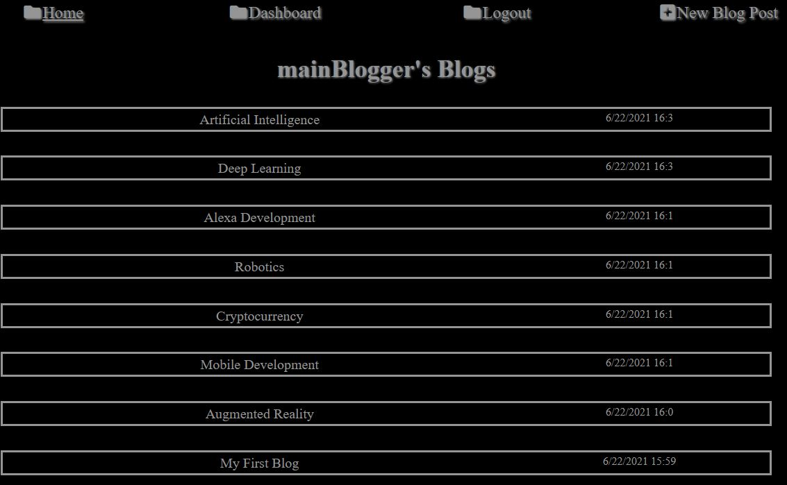
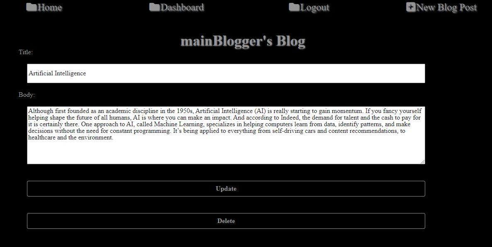
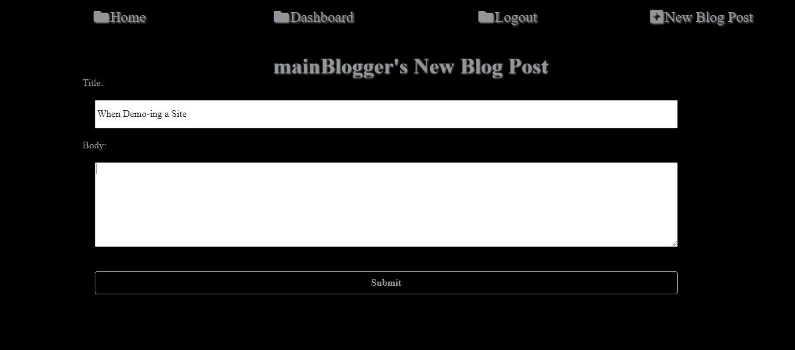
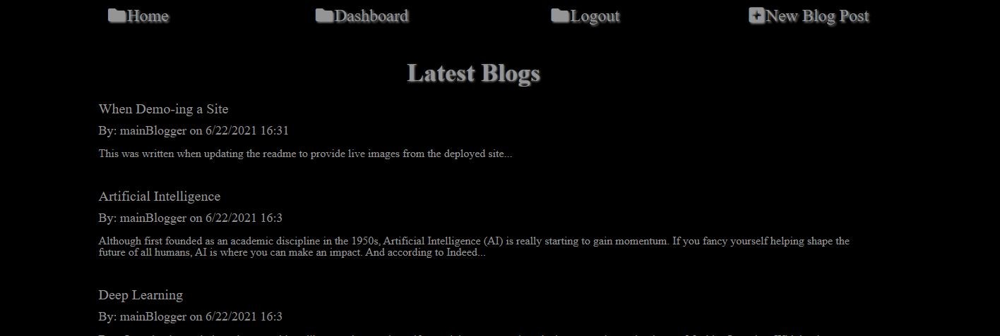
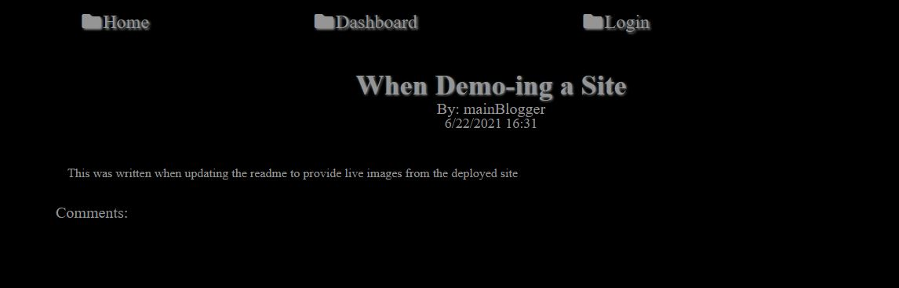

# Tech Blog


## Description

- The Tech Blog setup is a site that allows users to come together and blog
  about different topics that are on their mind. It allows users that are signed
  in to comment on different blogs to have further discussions on the topics.
- The technology used for this application are: node, javascript, mysql2 (npm),
  express (npm), dotenv (npm), sequelize (npm), express-handlebars (npm),
  express-session (npm), handlebarsjs (npm), bcrypt (npm), and nodemon (npm -
  dev only)
- The biggest challenge was deploying on heroku vs running local. Most things
  were pretty simple, but had to walk through setting up the sql_db using JAWS
  and some slight differences with paths that I had to account for.

## Table of Contents

- [Installation](#installation)
- [Usage](#usage)
- [License](#license)
- [Contributing](#contributing)
- [Demo](#demo)
- [Questions](#questions)

## Installation

To access the live environment you can go to this link:
https://brownnicholasj-techblog.herokuapp.com/

To run Locally, install the necessary dependencies, run the following command:

```
npm i
```

The following dependencies will be installed:

- mysql2
- express
- dotenv
- sequelize
- express-handlebars
- express-session
- handlebarsjs
- bcrypt
- nodemon

## Usage

The user will go to the live page and from the home page will be presented with
the latest blogs along with the navigation links in the header (top)


- clicking on the 'Home' link will direct the user back to this page/view

When the user clicks on an other link (Dashboard or Login) and are NOT logged
in, they will be taken to the login/signup page


When a new user signs up their username, email, and password are saved and they
are logged into the site. Their password passes through 'Bcrypt' and is hashed
before saving to the database  


After successfully signing up and/or logging in the user will see the navigation
change to allow them to 'Logout' or add 'New Blog Post'


The user can click on any blog from the homepage and be taken to the individual
blog page that will also display comments. If the user is logged in, they will
have the ability to add a comment 

The user can click on the 'Dashboard' link and be taken to a dashboard of their
blog posts. This list of posts are links that will allow the user to update the
blog and/or delete the blog 



If the logged in user clicks 'New Blog Post' from the navigation header they are
prompted with a title and body entry to enter a new blog


The user, after submitting the new blog, would be taken back to their dahsboard
where they would see their new entry among the rest of their blogs. On the
homepage the most recent blog would be listed first.


Clicking 'Logout' from the navigation bar will sign the user out. The user can
still click on the blogs from the homepage, they can see all of the blog pages
and comments, but are not allowed to add a comment


## License

This project is licensed under the ISC license.

## Contributing

A thanks to the following contributors to this project:

- Nicholas Brown (brownnicholasj.dev@gmail.com)
- TechCrunch.com (providing boilerplate topics to populate starter blogs)

### Behind the Code

- The database schema is stored and can be used to create the database with the
  MySQL shell commands <br> 

- The Database Models are defined within the models folder for Category,
  Product, Tag, and ProductTag: <br>
  <br>
  <br>
  <br>
  

- Associations are configured in the models folder within the index.js<br>
  

- Routes are defined within the routes/api folder to perform the CRUD actions
  for each api 

- Seed file provided can be ran to populate the database <br>
  

- Database access is done through variable file utilizing dotenv <br>
  

- Express is used to listen for api's and Sequelize is utilized to access and
  perform functions within the database <br>
  

## Questions

If you have any questions about the repo, open an issue or contact me directly
at brownnicholasj.dev@gmail.com.You can find more of my work on my GitHub:
[brownnicholasj](https://github.com/brownnicholasj/).
